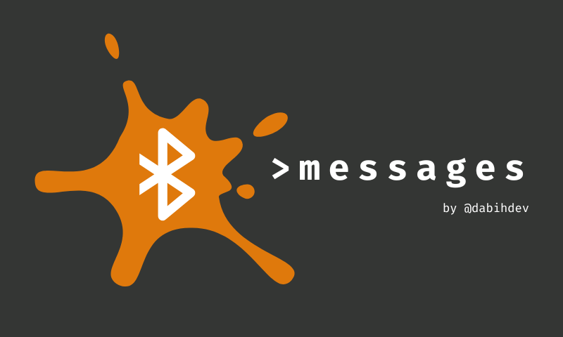

# BT-messages, a code project example to easily implement Bluetooth Low Energy (BLE) serial communication between smartphone and ESP32 smartdisplay

THIS IS NOT AN OFFICIAL BLUETOOTH PRODUCT, JUST A FREE PROJECT I MADE TO PLAY AROUND WITH ESP32 DISPLAY BOARDS ABILITY TO
COMMUNICATE WITH SMARTPHONES VIA BLUETOOTH.

## Example video

Board used here: ESP32-8048S070C.
To write and receive messages on my smartphone I used the Serial Bluetooth Application available on Google Play.

## Aknowledgment
- I build this project starting from the [esp32-smartdisplay-demo project](https://github.com/rzeldent/esp32-smartdisplay-demo)
- I used the [senseshift arduino BLE serial](https://github.com/senseshift/arduino-ble-serial) for the BLE serial communication